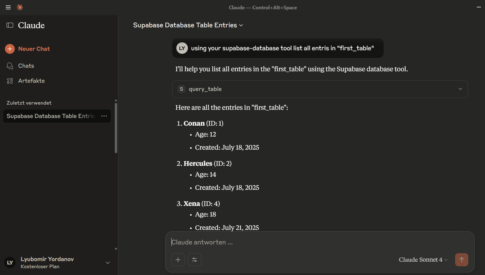

# Supabase MCP Server

## DEMO of this application using Claude Desktop MCP integraiton:



##  Context Engineering Workflow

This project follows a structured Context Engineering approach for AI-assisted development and feature implementation.

### Setup

1. **Repository klonen**: `git clone https://github.com/jquad-group/codemanufaktur-ce-demo.git`
2. **Projektregeln in GUIDELINES.md definieren** (team-übergreifende Richtlichen)
3. **Code-Beispiele im examples/ Ordner definieren** (stark empfohlen, hier nicht vorhanden)

### Workflow-Schritte

#### 1. Feature Request erstellen

- **THIS_PROJECT.md** mit konkreten Anforderungen für MCP Tools/Features bearbeiten
- Spezifische Supabase-Funktionalität und Database Requirements beschreiben
- Relevante Beispiele aus dediziertem Ordner referenzieren
- Supabase Dokumentation, MCP APIs usw. verlinken

#### 2. PRP (Product Requirements Prompt) generieren

- **Claude Code Kommando**: `/generate-prp THIS_PROJECT.md`
- Automatische Codebase-Analyse für MCP Server Patterns
- Sammlung relevanter Supabase und FastMCP Dokumentation
- Erstellung umfassender Implementierungs-Blueprint in `PRPs/`

#### 3. Features implementieren

**Für das Haupt-Projekt:**
- **Claude Code Kommando**: `/execute-prp THIS_PROJECT.md`

**Für neue Features:**
- **Claude Code Kommando**: `/execute-prp PRPs/new-feature-name.md`
- Neue PRP-Dateien werden automatisch in `PRPs/` erstellt

**Implementierung:**
- AI liest gesamten Kontext aus PRP (Database Schema, Security, Tools)
- Detaillierte Implementierungsplanung für MCP Tools
- Schrittweise Umsetzung mit Row Level Security Validierung

#### 4. Validierung & Testing

- Automatische Tests mit `pytest` und Linting mit `ruff`/`mypy`
- MCP Server Testing mit `uv run mcp dev src/mcp_server.py`
- Supabase Connection und RLS Policy Validierung
- Iterative Fehlerbehebung und Sicherstellung aller Erfolgskriterien

### Template-Struktur

```
context-engineering-mcp-db/
? .claude/commands/        # Custom Claude Code Kommandos
? PRPs/                    # Generated Product Requirements Prompts
?   ? templates/          # PRP Templates
?   ? supabase-mcp-server.md
? src/                     # MCP Server Implementation Examples
? tests/                   # Test Patterns und Validation Examples
? GUIDELINES.md           # Projekt-weite Regeln für AI Assistant
? THIS_PROJECT.md        # Projekt-Kontext und Architektur
```

### Best Practices für MCP Development

- **Konkrete Database Schema Beschreibungen** mit RLS Policy Requirements
- **Umfangreiche MCP Tool Beispiele** in `src/mcp_server.py`
- **Supabase API-Dokumentation** und FastMCP Patterns einbinden
- **Spezifische Security Constraints** und Row Level Security definieren
- **Test-Patterns für Database Operations** und Error-Handling inkludieren
- **Environment Configuration** für verschiedene Supabase Setups

---

A Model Context Protocol (MCP) server for secure Supabase database integration. Enables Claude and other AI assistants to interact with Supabase databases through high-level tools with built-in Row Level Security and comprehensive validation.

##  Quick Start

### 1. Prerequisites

- Python 3.13 or higher
- [uv](https://docs.astral.sh/uv/) package manager
- A Supabase project with database access
- **Database tables with Row Level Security (RLS) policies configured** (see [RLS Setup](#rls-setup) below)

### 2. Installation

```bash
# Clone the repository
git clone <repository-url>
cd context-engineering-mcp-db

# Install dependencies
uv sync

# Copy environment template
cp .env.example .env
```

### 3. Configuration

Edit your `.env` file with your Supabase credentials:

```bash
# Required: Supabase Configuration
SUPABASE_URL=https://your-project-id.supabase.co
SUPABASE_ANON_KEY=your-anon-key-here

# Optional: For admin operations
SUPABASE_SERVICE_ROLE_KEY=your-service-role-key-here

# Optional: Server configuration
LOG_LEVEL=INFO
MCP_SERVER_NAME=supabase-mcp
MCP_MAX_QUERY_LIMIT=1000
DEBUG=false
```

### 4. Test the Server

```bash
# Test with MCP Inspector
uv run mcp dev src/mcp_server.py

# Run unit tests
uv run pytest tests/ -v

# Check code style
uv run ruff check src/
uv run mypy src/
```

##  Project Structure

```
context-engineering-mcp-db/
   src/                     # Python source code
      __init__.py         # Package initialization
      mcp_server.py       # Main FastMCP server implementation
      database.py         # Supabase client management and utilities
   tests/                  # Comprehensive test suite
      __init__.py         # Test package initialization
      test_database.py    # Database module tests
      test_mcp_server.py  # MCP server tests
   PRPs/                   # Product Requirement Prompts
   .env.example            # Environment variables template
   .env                    # Local environment variables (create from template)
   .gitignore              # Git ignore rules
   pyproject.toml          # Python dependencies and project metadata
   README.md               # This file
```

##  Configuration

### Environment Variables

| Variable | Required | Default | Description |
|----------|----------|---------|-------------|
| `SUPABASE_URL` | Yes | - | Your Supabase project URL |
| `SUPABASE_ANON_KEY` | Yes | - | Supabase anonymous key for normal operations |
| `SUPABASE_SERVICE_ROLE_KEY` | No | - | Service role key for admin operations |
| `LOG_LEVEL` | No | INFO | Logging level (DEBUG, INFO, WARNING, ERROR) |
| `MCP_SERVER_NAME` | No | supabase-mcp | Name for the MCP server |
| `MCP_MAX_QUERY_LIMIT` | No | 1000 | Maximum query result limit |
| `DEBUG` | No | false | Enable debug mode |

### Getting Supabase Credentials

1. Go to [supabase.com](https://supabase.com) and create/open your project
2. Navigate to **Settings** ? **API**
3. Copy your **Project URL** and **anon public** key
4. For admin operations, copy the **service_role** key ( keep this secure!)

##  RLS Setup

### Why RLS is Required

This MCP server relies on Supabase's Row Level Security (RLS) to ensure secure database access. Without properly configured RLS policies, you may encounter:
- "No rows returned" errors even when data exists
- Permission denied errors
- Inability to insert or update records

### Basic RLS Configuration

1. **Enable RLS on your tables** (if not already enabled):
```sql
-- Enable RLS on a table
ALTER TABLE your_table_name ENABLE ROW LEVEL SECURITY;
```

2. **Create policies for your use case**:

**For public read access** (development/testing):
```sql
-- Allow all users to read all rows
CREATE POLICY "Enable read access for all users" 
ON your_table_name FOR SELECT 
USING (true);
```

**For authenticated users only**:
```sql
-- Allow authenticated users to read all rows
CREATE POLICY "Enable read access for authenticated users" 
ON your_table_name FOR SELECT 
TO authenticated 
USING (true);

-- Allow authenticated users to insert their own records
CREATE POLICY "Enable insert for authenticated users" 
ON your_table_name FOR INSERT 
TO authenticated 
WITH CHECK (true);

-- Allow users to update their own records (if you have a user_id column)
CREATE POLICY "Users can update own records" 
ON your_table_name FOR UPDATE 
TO authenticated 
USING (auth.uid() = user_id)
WITH CHECK (auth.uid() = user_id);
```

**For anon key access** (when using SUPABASE_ANON_KEY):
```sql
-- Allow anon users to read all rows
CREATE POLICY "Enable read access for anon users" 
ON your_table_name FOR SELECT 
TO anon 
USING (true);

-- Allow anon users to insert records
CREATE POLICY "Enable insert for anon users" 
ON your_table_name FOR INSERT 
TO anon 
WITH CHECK (true);

-- Allow anon users to update records
CREATE POLICY "Enable update for anon users" 
ON your_table_name FOR UPDATE 
TO anon 
USING (true)
WITH CHECK (true);
```

### Testing RLS Policies

After setting up policies, test them in the Supabase SQL editor:

```sql
-- Test if you can read data
SELECT * FROM your_table_name LIMIT 5;

-- Test if you can insert data
INSERT INTO your_table_name (column1, column2) 
VALUES ('test_value1', 'test_value2');
```

### Advanced RLS Patterns

For production applications, consider more restrictive policies:

```sql
-- Multi-tenant: Users can only access their organization's data
CREATE POLICY "Users access own organization data" 
ON your_table_name FOR ALL 
TO authenticated 
USING (organization_id = (
  SELECT organization_id 
  FROM user_profiles 
  WHERE user_id = auth.uid()
));

-- Time-based access: Only allow access to recent records
CREATE POLICY "Access recent records only" 
ON your_table_name FOR SELECT 
USING (created_at > NOW() - INTERVAL '30 days');
```

### Quick RLS Troubleshooting

If you're getting "No data" errors:
1. Check if RLS is enabled: `SELECT tablename, rowsecurity FROM pg_tables WHERE tablename = 'your_table';`
2. List existing policies: `SELECT * FROM pg_policies WHERE tablename = 'your_table';`
3. Test with service role key (bypasses RLS) to confirm data exists
4. Verify your policies match your authentication method (anon vs authenticated)

 **Learn More**: [Supabase RLS Documentation](https://supabase.com/docs/guides/auth/row-level-security)

##  Development

### Local Development Workflow

```bash
# Install dependencies
uv sync

# Run linting and type checking
uv run ruff check src/ --fix
uv run mypy src/

# Run tests
uv run pytest tests/ -v

# Start MCP server for testing
uv run python src/mcp_server.py

# Test with MCP Inspector
uv run mcp dev src/mcp_server.py
```

### Adding New Features

1. Follow the patterns in existing code
2. Add comprehensive tests in `tests/`
3. Update documentation
4. Run validation suite before committing

##  Testing

### Running Tests

```bash
# Run all tests
uv run pytest tests/ -v

# Run specific test file
uv run pytest tests/test_database.py -v

# Run with coverage
uv run pytest tests/ --cov=src --cov-report=html

# Run tests with detailed output
uv run pytest tests/ -v -s
```

### Test Structure

- **Unit Tests**: Test individual functions and classes
- **Integration Tests**: Test MCP tool integration
- **Mocked Tests**: Test with mocked Supabase dependencies
- **Validation Tests**: Test security and input validation

##  Available Tools

The MCP server provides 5 core database tools:

### 1. `list_tables`
Lists all accessible tables in the Supabase database.

```python
# Usage in Claude
"Show me all tables in the database"
```

**Returns**: List of tables with names, types, and schemas

### 2. `query_table`
Query a specific table with optional filters and pagination.

```python
# Usage examples
"Show me the first 10 users"
"Find all active users"
"Get orders from the last week with status 'pending'"
```

**Parameters**:
- `table_name`: Name of the table to query
- `limit`: Maximum results (default: 100, max: 1000)
- `filters`: Key-value pairs for filtering

**Returns**: JSON formatted query results

### 3. `describe_table`
Get detailed schema information for a specific table.

```python
# Usage in Claude
"What's the schema of the users table?"
"Show me the structure of the orders table"
```

**Parameters**:
- `table_name`: Name of the table to describe

**Returns**: Table schema with columns, types, constraints, and relationships

### 4. `insert_record`
Insert a new record into a table with validation.

```python
# Usage in Claude
"Add a new user with name 'John Doe' and email 'john@example.com'"
"Create a new order for user ID 123"
```

**Parameters**:
- `table_name`: Table to insert into
- `data`: Record data as key-value pairs

**Returns**: Inserted record details

### 5. `update_record`
Update existing records based on filter conditions.

```python
# Usage in Claude
"Update the user with ID 123 to set status as 'inactive'"
"Change all pending orders to 'processing'"
```

**Parameters**:
- `table_name`: Table to update
- `filters`: Conditions to identify records
- `updates`: New values to set

**Returns**: Updated record details

## ? Security Features

### Input Validation
- **SQL Injection Protection**: All inputs validated against dangerous patterns
- **Table Name Validation**: Only alphanumeric and underscore characters allowed
- **System Table Protection**: Blocks access to PostgreSQL and Supabase system tables
- **Size Limits**: Prevents excessively large data values

### Row Level Security (RLS)
- Leverages Supabase's built-in Row Level Security
- User context automatically applied to all operations
- No direct SQL injection possible through the MCP interface

### Protected Operations
- **Primary Key Protection**: Prevents updating ID and timestamp columns
- **Mass Update Prevention**: Requires filters for all update operations
- **Query Limits**: Enforces reasonable pagination limits

## ? Claude Desktop Integration

### Option 1: Automatic Installation
```bash
uv run mcp install src/mcp_server.py --name "Supabase Database"
```

### Option 2: Manual Configuration

Add to your Claude Desktop configuration file:

**macOS**: `~/Library/Application Support/Claude/claude_desktop_config.json`
**Windows**: `%APPDATA%/Claude/claude_desktop_config.json`

#### Windows Example:
```json
{
  "mcpServers": {
    "supabase-database": {
      "command": "uv",
      "args": [
        "--directory",
        "C:/home/business/dev/ai/context-engineering-mcp-db",
        "run",
        "python",
        "-m",
        "src.mcp_server"
      ],
      "env": {
        "SUPABASE_URL": "https://your-project.supabase.co",
        "SUPABASE_ANON_KEY": "your-anon-key-here"
      }
    }
  }
}
```

#### macOS/Linux Example:
```json
{
  "mcpServers": {
    "supabase-database": {
      "command": "uv",
      "args": [
        "--directory",
        "/absolute/path/to/context-engineering-mcp-db",
        "run",
        "python",
        "-m",
        "src.mcp_server"
      ],
      "env": {
        "SUPABASE_URL": "https://your-project.supabase.co",
        "SUPABASE_ANON_KEY": "your-anon-key-here"
      }
    }
  }
}
```

 **Important**: 
  - Use absolute paths in the `--directory` argument
  - Replace the directory path with your actual project location
  - Use forward slashes `/` even on Windows (as shown in the examples above)

### Verification

1. Restart Claude Desktop
2. Check for the tools icon () in the interface
3. Try a natural language query: "Show me all tables in my database"

##  Troubleshooting

### Common Issues

#### Server Won't Start
```bash
# Check environment variables
cat .env

# Verify Supabase credentials
# Test connection manually
```

**Solution**: Ensure all required environment variables are set correctly.

#### No Tables Visible
```bash
# Test with MCP inspector
uv run mcp dev src/mcp_server.py

# Call list_tables manually
```

**Possible causes**:
- Database permissions issue
- RLS policies blocking access
- Empty database

#### RLS Policy Issues (Most Common)
If you can connect but get "No data" or permission errors:

```bash
# Check if RLS is enabled on your table
# In Supabase SQL editor or psql:
SELECT tablename, rowsecurity FROM pg_tables WHERE tablename = 'your_table_name';

# List existing policies
SELECT * FROM pg_policies WHERE tablename = 'your_table_name';

# Test with service role key (bypasses RLS) to confirm data exists
# Temporarily update .env with SUPABASE_SERVICE_ROLE_KEY and test
```

**Common Solutions**:
1. **Missing policies**: Add basic RLS policies (see [RLS Setup](#rls-setup))
2. **Wrong key type**: Use `anon` policies for `SUPABASE_ANON_KEY`, `authenticated` for user sessions
3. **Overly restrictive policies**: Start with `USING (true)` for testing, then refine
4. **RLS not enabled**: Run `ALTER TABLE your_table ENABLE ROW LEVEL SECURITY;`

#### Claude Desktop Integration Issues
1. **Tools not appearing**: Check Claude Desktop logs at `~/Library/Logs/Claude/mcp*.log`
2. **Permission errors**: Verify absolute paths in configuration
3. **Environment variables**: Ensure credentials are in Claude Desktop config

#### Validation Errors
```bash
# Run tests to identify issues
uv run pytest tests/test_database.py -v

# Check input validation
uv run python -c "from src.database import validate_table_name; print(validate_table_name('your_table'))"
```

### Debug Mode

Enable detailed logging:
```bash
# In .env file
DEBUG=true
LOG_LEVEL=DEBUG

# Or set environment variable
export DEBUG=true
export LOG_LEVEL=DEBUG
uv run python src/mcp_server.py
```

### Performance Issues

If queries are slow:
1. Check Supabase performance metrics
2. Add database indexes for frequently queried columns
3. Reduce query limits
4. Enable RLS policies for better security and performance

##  Monitoring

### Logs
- **Server logs**: Written to stderr (visible in terminal)
- **Claude Desktop logs**: `~/Library/Logs/Claude/mcp*.log`
- **Debug information**: Enable with `DEBUG=true`

### Health Checks
```bash
# Test connection health
uv run python -c "
from src.database import SupabaseManager
import os
from dotenv import load_dotenv

load_dotenv()
manager = SupabaseManager(os.getenv('SUPABASE_URL'), os.getenv('SUPABASE_ANON_KEY'))
print(manager.test_connection())
"
```

##  Contributing

1. **Follow Code Style**: Use `ruff` for formatting and `mypy` for type checking
2. **Write Tests**: Add tests for new features in `tests/`
3. **Update Documentation**: Keep README and docstrings current
4. **Security First**: Follow security best practices for database access

### Development Guidelines

- Use Python 3.13+ with strict type hints
- Follow the patterns established in existing code
- Add comprehensive error handling
- Include both positive and negative test cases
- Document all public functions with Google-style docstrings

## ? Architecture

### Core Components

1. **FastMCP Server** (`src/mcp_server.py`): Main server with tool implementations
2. **Database Manager** (`src/database.py`): Supabase client wrapper with validation
3. **Pydantic Models**: Type-safe request/response validation
4. **Security Layer**: Input validation and SQL injection prevention

### Design Principles

- **Security First**: Multiple layers of validation and protection
- **Type Safety**: Comprehensive type hints and Pydantic validation
- **Error Handling**: Graceful degradation with informative error messages
- **Performance**: Efficient queries with reasonable limits
- **Usability**: Natural language interface through Claude integration

##  License

This project follows the license specified in the repository.

##  Support

For issues and questions:

1. Check this README for common solutions
2. Review the troubleshooting section
3. Examine the test files for usage examples
4. Check Supabase documentation for database-specific issues

---

**Built with  using FastMCP, Supabase, and Pydantic**